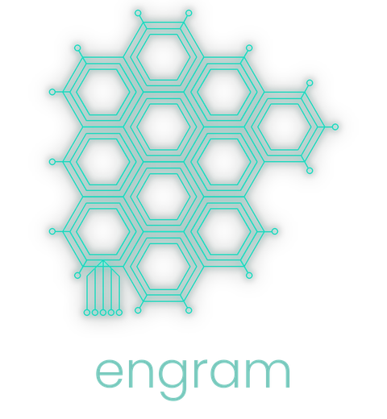

# engram



Correction memory for LLMs.

Every time you correct an AI — "that function doesn't exist," "my project uses X not Y," "stop formatting in markdown" — that correction vanishes when the conversation ends. Next session, the same mistake. engram fixes this.

It stores corrections as atomic facts in a local SQLite database, retrieves relevant ones via BM25 full-text search, and injects them into future AI sessions. The AI learns from corrections permanently, not just for one conversation.

## How it works

```
You correct the AI  →  engram stores the fact  →  next session, engram injects it  →  mistake never repeats
```

engram is a single CLI binary. No daemon, no cloud. It integrates with Claude Code via prompt hooks that run on every message, and with other editors (Cursor, Windsurf, Claude Desktop) via a built-in MCP server. The hook reads the user's prompt, uses it as a search query to retrieve the most relevant corrections, detects correction patterns (like "actually," "that's wrong," "we use X not Y"), and injects a targeted instruction that triggers the AI to store the correction. A secondary hook monitors tool calls and reminds the AI if it forgets to store a detected correction. You never interact with engram directly — you just talk to the AI.

### How is this different from MemPalace?

[MemPalace](https://github.com/MemPalace/mempalace) is a full conversation memory system — it remembers *everything* from past sessions using vector embeddings and a knowledge graph. It's designed for total recall across long histories. engram is a correction memory — it remembers only what you got *wrong*, and it's built to do that one thing as fast as possible. MemPalace needs ChromaDB, Python, and an embedding model. engram is a single 4.8MB binary with a 3ms query time. Use MemPalace if you want an AI that remembers entire conversations. Use engram if you want an AI that stops repeating the same mistakes.

### How is this different from Claude Code's built-in memory?

Claude Code has its own memory system (markdown files in `~/.claude/projects/`). It's general-purpose context that the LLM reads when it thinks it's relevant. engram is purpose-built for corrections with structured retrieval.

| | Claude Code memory | engram |
|---|---|---|
| Storage | Markdown files | SQLite + FTS5 |
| Retrieval | LLM reads files it thinks are relevant | BM25 ranked search, scoped |
| Scope | Per-project directory path | global / project / domain |
| Search | LLM judgment | Full-text search with ranking |
| Structure | Freeform markdown | Typed atomic facts with tags, scope, trigger hints, hit tracking |
| Focus | General — user prefs, project context, references | Specific — corrections that prevent repeated mistakes |

They're complementary. Claude Code memory remembers "this user prefers terse responses." engram remembers "this project uses toml not viper" and retrieves it when config parsing comes up.

## Install

```bash
# Clone and build
git clone <repo-url>
cd engram
make build

# Install to /usr/local/bin (may require sudo)
sudo make install

# Or install manually
sudo cp engram /usr/local/bin/
```

## Setup

One command per project. That's it.

```bash
cd ~/projects/myproject
engram init --project
```

This creates the `.engram` project marker, installs the prompt hook, adds slash commands (`/remember`, `/forget`, `/recall`, `/corrections`), and writes engram behavior instructions to CLAUDE.md. The database is created automatically on first use — no separate init step.

Start a new Claude Code conversation and corrections accumulate automatically.

### Other editors (Cursor, Windsurf, Claude Desktop, etc.)

engram includes a built-in MCP server. Add this to your editor's MCP settings:

```json
{"mcpServers": {"engram": {"command": "engram", "args": ["mcp"]}}}
```

This exposes three tools to the AI: `store` (save a correction), `search` (find corrections by query), and `get` (retrieve relevant corrections for the current context). The MCP server speaks JSON-RPC 2.0 over stdio — no network, no daemon.

### Slash commands (Claude Code)

| Command | What it does |
|---|---|
| `/remember` | Store a correction, preference, or fact |
| `/forget` | Find and delete a stored correction |
| `/recall` | Retrieve relevant corrections for the current topic |
| `/corrections` | List, search, export, and manage all corrections |

You can also run `engram init` separately to explicitly create the global config and database, or `engram init --hooks` to reinstall just the Claude Code integration without touching the project marker.

## What it looks like in practice

You're working on a project and the AI suggests using viper for config parsing:

```
You:  We don't use viper in this project, we use BurntSushi/toml.
AI:   ▣ Stored in engram memory: project uses BurntSushi/toml, not viper.
      Here's the corrected version...
```

Behind the scenes, the AI runs:
```bash
engram store "This project uses BurntSushi/toml for config, not viper." \
  --type fact \
  --scope project:myproject \
  --trigger "when writing config loading or suggesting config libraries" \
  --tags "config,toml,burntsushi,viper,parsing,configuration,settings" \
  --wrong "viper"
```

Next session, before you even say anything, the hook injects:
```
FACTS:
  1. [project:myproject] This project uses BurntSushi/toml for config, not viper.
```

The AI never makes that mistake again.

## Correction types

Each correction has a type that controls how it's presented to the AI:

| Type | Purpose | Example |
|---|---|---|
| `fact` | Technical fact about the project or environment | "This project uses BurntSushi/toml for config." |
| `preference` | Style, format, or workflow preference | "Prefer compact prose over bullet points." |
| `constraint` | Something that must never be violated | "The write queue must never be removed — prevents data corruption." |
| `gotcha` | A known trap or non-obvious behavior | "Go 1.22 does not support range over integers." |
| `process` | A workflow step or procedure | "Always run the linter before committing." |

When corrections are injected, they're grouped by type with constraints shown first:

```
CONSTRAINTS — never violate these:
  1. [project:myproject] The write queue must never be removed.

GOTCHAS — known traps:
  2. [domain:go] Go 1.22 does not support range over integers.

FACTS:
  [project:myproject]
    3. This project uses BurntSushi/toml for config, not viper.
    4. The dev server binds to port 8080.
    5. Auth tokens expire after 1 hour.

PREFERENCES:
  6. [global] Prefer compact prose over bullet points.
```

When 3+ corrections share the same scope, they're clustered under a single header to save tokens.

## Trigger hints

Each correction can have a trigger hint — a short description of *when* it should surface:

```bash
engram store "Always validate user input before SQL queries." \
  --trigger "when writing database queries or API handlers"
```

Trigger hints are indexed by FTS5 and contribute to search relevance. They let the AI front-load semantic context at store time, so retrieval doesn't have to guess when a correction is relevant.

## Retrieval

engram uses a five-tier search cascade, stopping at the first tier that returns results:

1. **Exact phrase match** — highest precision
2. **AND match** — all non-stop-word terms must appear (handles reordering)
3. **OR match** — any term matches (broadest recall)
4. **Trigram match** — substring and partial-match recall via a secondary FTS5 trigram index
5. **LIKE fallback** — for special characters and single-character queries FTS5 rejects

The primary FTS5 index uses a code-friendly tokenizer (`unicode61`) that keeps identifiers like `burntsushi/toml`, `use_state`, `grpc-web`, and `config.toml` as single tokens instead of splitting on `-`, `_`, `.`, or `/`.

Results are ranked by a composite score that combines BM25 text relevance, hit frequency (log-scale), recency (365-day exponential decay with a 5% floor), confidence, and a tier bonus (project-scoped corrections get a 1.5× bonus, global gets 1.2×, domain gets 1.0×). Final selection uses Maximal Marginal Relevance (MMR) to prevent near-duplicate corrections from saturating the token budget.

Common English stop words (a, the, is, etc.) are filtered from queries. Negation words (`not`, `no`) are intentionally preserved — corrections are often about what *not* to do.

## Benchmarks

### CLI wall time (full round-trip)

Total time from process launch to output, including Go runtime startup, config loading, SQLite open, query, and output. Measured with `time` on an AMD Ryzen 7 7735HS.

| Corpus size | `store` | `get` (query) | `get --all` | `search` | `list` |
|---|---|---|---|---|---|
| 10 | 3ms | 3ms | 3ms | 3ms | 3ms |
| 100 | 3ms | 4ms | 4ms | 4ms | 3ms |
| 1,000 | 3ms | 5ms | 7ms | 5ms | 3ms |
| 5,000 | 3ms | 12ms | 24ms | 14ms | 5ms |

### Internal benchmarks (no process startup)

Pure query time measured by Go's `testing.B` framework:

| Corpus size | BM25 search | BM25 + scope filter | Phrase cascade | Store | List |
|---|---|---|---|---|---|
| 10 | 0.43ms | - | - | 0.08ms | - |
| 100 | 0.55ms | - | - | 0.08ms | - |
| 1,000 | 1.4ms | - | 1.2ms | 0.08ms | 0.06ms |
| 10,000 | 6.3ms | 4.0ms | 4.7ms | 0.08ms | - |

### What this means

- **Store is constant-time** regardless of corpus size (single INSERT + FTS trigger)
- **Search scales linearly** with corpus but stays under 15ms even at 5,000 corrections
- **Phrase cascade is faster** than the old OR-only approach at large corpus sizes because the phrase tier short-circuits early
- **The hook** runs `engram hook` on every prompt — reads stdin JSON, outputs corrections, and checks for correction patterns. At typical corpus sizes (10-500 corrections), that's 3-5ms. Invisible.
- **No embedding inference on the hot path.** The entire retrieval is BM25 over SQLite FTS5. Compare to vector-DB systems that need 50-200ms per query for embedding inference alone.

Run benchmarks yourself: `make bench`

## Scopes

Corrections are scoped so the right facts appear in the right context:

- **global** — preferences and facts that apply everywhere ("prefer prose over bullet points")
- **project:name** — facts about a specific codebase ("this project uses age for encryption")
- **domain:tag** — facts about a technology ("Go 1.22 doesn't support range over integers")

engram auto-detects projects by walking up the directory tree looking for a `.engram` marker file (created by `engram init --project`). Commit this file to share project-scoped memory with your team.

When corrections are selected for injection, scope is a soft preference via the tier bonus (project 1.5×, global 1.2×, domain 1.0×). A strongly-matching global correction can still outrank a weakly-matching project correction.

## CLI reference

```
engram init                  Initialize config and database
engram init --project        Set up engram in current project (marker + hooks)
engram init --hooks          Reinstall just the Claude Code integration

engram store <fact>          Store a correction
  --scope <scope>              global, project:<name>, domain:<tag> (default: auto-detect)
  --type <type>                fact, preference, constraint, gotcha, process (default: fact)
  --trigger "<when>"           When to surface this correction (situation description)
  --wrong "<text>"             What was previously assumed incorrectly
  --tags "<comma,separated>"   Tags for retrieval (5-10 recommended)
  --supersedes <id>            ID of the correction this replaces
  --source <user|inferred>     How the correction originated
  --force                      Bypass duplicate check and store anyway

engram get [query]           Retrieve relevant corrections
  --all                        Return all corrections for current scope
  --raw                        Plain text output (one per line)
  --scope <scope>              Filter by scope
  --limit <n>                  Max corrections returned

engram list                  List all corrections
  --scope <scope>              Filter by scope
  --tag <tag>                  Filter by tag
  --stale                      Show only corrections not retrieved in 180 days
  --limit <n>                  Max results

engram search <query>        Search with BM25 relevance scores
engram delete <id>           Delete a correction
engram edit <id>             Edit a correction in $EDITOR
engram stats                 Usage statistics, type breakdown, and stale count
engram export                Export as JSON or TOML
engram import <file>         Import from JSON or TOML
engram vacuum                Rebuild FTS index and optimize database
engram hook                  Claude Code prompt hook (reads stdin, detects corrections)
engram mcp                   Start MCP stdio server (for Cursor, Windsurf, etc.)

Global flag:
  --db <path>                Skip config loading, use database directly
```

## Storage

Everything lives in a single SQLite file at `~/.local/share/engram/engram.db`. Back it up with `cp`. Inspect it with `sqlite3`. Move it to a new machine by copying the file.

Retrieval uses two SQLite FTS5 indexes — a primary index with a code-friendly tokenizer for precise matching, and a secondary trigram index for partial/substring matching — ranked by BM25 with a five-tier search cascade. No embedding models, no vector databases, no network calls.

## Config

`~/.config/engram/config.toml`:

```toml
[database]
path = "~/.local/share/engram/engram.db"

[injection]
max_corrections = 10    # max corrections per retrieval
max_tokens      = 300   # token budget for injection block
min_score       = 0.0   # minimum BM25 relevance score

[log]
level = "warn"
```

## Design principles

- **One binary.** No Docker, no runtime, no Node. `make build` and done. 4.8MB.
- **Two dependencies.** SQLite and TOML. That's it. No frameworks, no MCP SDK.
- **No daemon.** No background process, no network listener. The MCP server is a stdio subprocess spawned by your editor — it lives and dies with the session.
- **Fast.** 3ms total wall time. Sub-5ms search on 10,000 corrections.
- **Private.** Everything local. No telemetry. No cloud.
- **Invisible.** After setup, you never think about engram. You just talk to the AI.

## License

[MIT](LICENSE)
